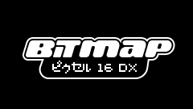
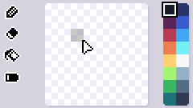
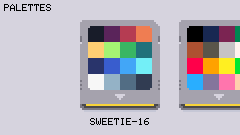
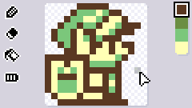
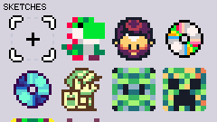

# BitMap16 DX


A tiny pixel-art workstation firmware for the M5Stack Cardputer ADV. 



## Features (SD card required)
- 8×8 and 16×16 canvas modes
- Draw, Erase, Fill tools
- Undo last action
- Built-in 16, 8, and 4-color palettes  
*Custom palettes can be added by placing Lospec `.hex` files in the `bitmap16dx/palettes/` directory. (32 total)*
- Export `.png` files to `bitmap16dx/exports/` (128x128 or logical size)

### Palettes



BitMap16DX includes curated palettes from Lospec, and you can add your own by placing `.hex` files in the `bitmap16dx/palettes/` directory on your SD card.

## How to Use

### Drawing Mode



| Key | Function |
|-----|----------|
| Arrow keys (`↑` `←` `↓` `→`) | Move cursor (hold to repeat) |
| `ok`/`enter` | Place pixel with selected color |
| `del`/`backspace` | Erase pixel |
| `1-8` | Quick color selection (colors 1-8) |
| `fn + 1-8` | Quick color selection (colors 9-16) |
| `C` | **C**ycle to next color |
| `F` | Flood **f**ill |
| `G` | Toggle between 8×8 and 16×16 **g**rid |
| `Z` | Undo last action |
| `g0` button | Clear canvas |
| `S` | **S**ave sketch (update current or create new) |
| `FN + S` | **S**ave as new sketch (always creates new file) |
| `X` | E**x**port PNG (128×128 scaled) |
| `FN + X` | Export PNG (logical size: 8×8 or 16×16) |
| `I` | Open help screen |
| `P` | Open **P**alette Menu |
| `O` | **O**pen Sketches Menu |
| `V` | Open Pre**v**iew Mode |

### Palette Menu *(P)*

| Key | Function |
|-----|----------|
| `←`/`→` | Navigate palettes |
| `ok`/`enter` | Select palette |
| `esc` | Dismiss |
| `4` | Toggle 4-color filter |
| `8` | Toggle 8-color filter |
| `1` | Toggle 16-color filter|
| `U` | Toggle custom user palettes filter (can be combined with 4/8/16 filters) |
| `0` | Clear all filters |

### Sketches Menu *(O)*



| Key | Function |
|-----|----------|
| Arrow keys (`↑` `←` `↓` `→`) | Navigate sketch grid |
| `ok`/`enter` | Load selected sketch |
| `esc` | Dismiss |
| `g0` button | Delete focused sketch |
| `z`  | undo |

### Preview Mode *(V)*

| Key | Function |
|-----|----------|
| `1` | Black background |
| `2` | White background |
| `3` | Gray background |
| `esc` | Dismiss |


### Project Structure

```
BitMap16DX/
├── platformio.ini          # PlatformIO configuration
├── src/
│   ├── main.cpp           # Main firmware code
│   ├── palettes.h         # Default Color palette definitions
│   ├── icons.h            # UI icons
│   ├── cartridge_graphic.h # Cartridge sprite
│   └── boot_image.h       # Splash screen
```

### What's Next
- I2C module support (joystick/buttons)
- Bluetooth keyboard/controller support
- Non-ADV support
- Background music/UI sound

### Completed Features
- ✅ 8×8 and 16×16 pixel grid with dynamic toggling
- ✅ Cursor movement with key repeat and visual feedback
- ✅ Pixel placement/erasing with line drawing support
- ✅ Flood fill tool (paint bucket)
- ✅ Color palette system (4/8/16 color support)
- ✅ Custom Color palettes (.hex files)
- ✅ Unlimited sketch storage on SD card
- ✅ Save/Save As functionality with auto-increment
- ✅ Full undo system
- ✅ PNG export (scaled and logical size)
- ✅ Full-screen view mode with background options
- ✅ Help/info screen
- ✅ Battery indicator
- ✅ Smooth animations and transitions
- ✅ Versioning for sketch file format
- ✅ Improved SD card error handling
