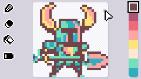
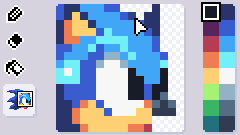

# BitMap16 DX

BitMap16 DX is a tiny pixel-art sketchbook for the M5Stack Cardputer ADV,
channeling the vibe of 2000s handheld game consoles.


## Features

- 8×8, 16×16, and 32×32 canvas modes
- Draw, Erase, Fill, Erase Fill, and Move tools
- Canvas zoom and pixel-accurate minimap
- Undo and redo
- Save, open, duplicate, preview, and delete sketches from SD card
- Built-in 16, 8, and 4-color palettes
  - Palette swapping preserves indexed artwork when moving between smaller
    and larger palettes
  - Import Lospec `.hex` palettes from SD card
  - StampS3A LED displays currently selected color
- Export `.png` files to `bitmap16dx/exports/` at 128×128 or logical size
- Light and dark themes
- Preview/gallery mode
- Charging screensaver mode
- Shake-to-undo
- Display mirroring with Puzzle Unit 8×8 RGB LED Matrix modules (WS2812E)


## First boot

1. **Insert SD card** before powering on (FAT32 format recommended)
2. Power on your Cardputer
3. BitMap16 DX will automatically create these folders:
   ```
   /bitmap16dx/
   ├── sketches/   # Your saved artwork
   ├── exports/    # Exported PNG files
   └── palettes/   # Custom color palettes (optional)
   ```
4. Start drawing!

## Adding custom palettes (Optional)

1. Download `.hex` palette files from [Lospec](https://lospec.com/palette-list)
2. Copy to `/bitmap16dx/palettes/` on your SD card
3. Power cycle your Cardputer
4. Access custom palettes in the Palette Menu

BitMap16 DX supports 4-, 8-, and 16-color palettes, with a maximum of 32
palettes total (12 built-in and up to 20 custom).

## How to Use

### Drawing Mode






| Key | Function |
|-----|----------|
| Arrow keys (`↑` `←` `↓` `→`) | Move cursor (hold to repeat) |
| `ctrl, ok`/`enter ` | Place pixel with selected color |
| `del`/`backspace` | Erase pixel |
| `F` | Flood **f**ill |
| `fn` + `F` | Flood fill with transparency (**Erase Fill**) |
| `M` + `Arrow keys` | **M**ove canvas |
| `1-8` | Quick color selection (colors 1-8) |
| `fn` + `1-8` | Quick color selection (colors 9-16) |
| `C` | **C**ycle to next color |
| `G` | Cycle the 8×8, 16×16, and 32×32 **g**rid |
| `+` / `-` | Zoom canvas in/out at integer pixel scales |
| `fn` + `Arrow keys` | While zoomed, jump to that edge of the artwork |
| `R` | Toggle viewport-centered **r**ulers |
| `T` | Toggle Se**t**tings |
| `Z` | Undo last action (or shake when enabled) |
| `fn` + `Z` | Redo last action |
| `g0` button | Clear canvas |
| `S` | **S**ave sketch (update current or create new) |
| `FN` + `S` | **S**ave as new sketch (always creates new file) |
| `X` | E**x**port PNG (128×128 scaled) |
| `FN` + `X` | Export PNG at its logical grid size |
| `H` | Open **h**elp screen (key commands) |
| `P` | Open **P**alette Menu |
| `O` | **O**pen Sketches Menu |
| `V` | Open Pre**v**iew Mode |
| `B` + `+/-` | Adjust **b**rightness |
| `FN` + `B` | Charging Mode |
| `L` + `Ok` | RGB Matrix on/off |
| `L` + `+/-` | RGB Matrix brightness |

### Drawing Preview *(V)*

| Key | Function |
|-----|----------|
| `1` | Black background |
| `2` | White background |
| `3` | Light gray background |
| `4` | Dark gray background |
| `+` / `-` | Zoom preview at integer scales |
| `esc` | Dismiss |

### Palette Menu *(P)*

| Key | Function |
|-----|----------|
| `←`/`→` | Navigate palettes |
| `ok`/`enter` | Select palette |
| `esc` | Dismiss |
| `4` | Toggle 4-color filter |
| `8` | Toggle 8-color filter |
| `1` | Toggle 16-color filter|
| `U` | Toggle custom user palettes filter (can be combined with 4/8/16 filters) |
| `0` | Clear all filters |

### Sketches Menu *(O)*


| Key | Function |
|-----|----------|
| Arrow keys (`↑` `←` `↓` `→`) | Navigate sketch grid |
| `ok`/`enter` | Load selected sketch |
| `V` | Open slideshow **v**iew |
| `esc` | Dismiss |
| `g0` button | Delete focused sketch |
| `Z` | Restore the most recently deleted sketch |
| `fn` + `S` | Duplicate the focused sketch |

### Sketch Slideshow View *(V from Sketches Menu)*

View your saved sketches in a fullscreen slideshow with optional auto-advance.

| Key | Function |
|-----|----------|
| `←`/`→` | Navigate previous/next sketch |
| `space` | Toggle auto-advance (3 second intervals) |
| `1` | Black background |
| `2` | White background |
| `3` | Light gray background |
| `4` | Dark gray background |
| `B` + `+/-` | Adjust **b**rightness |
| `esc` | Return to Sketches |

### Settings *(T)*

- Set UI theme (light, dark)
- Set default grid (8×8, 16×16, or 32×32)
- Set export format (RGB888, RGB565)
- RGB Matrix settings:
  - Enable/disable matrix output
  - Set matrix layout (1 or 4 units)
  - Set matrix rotation (0°, 90°, 180°, or 270°)
  - Set matrix brightness
- Enable Shake to Undo (IMU accelerometer)
- Enable or disable save warnings
- Indicator LED settings:
  - Show the currently selected palette color
  - Override the palette color with a red low-battery warning at 10%


## RGB LED Matrix mirroring

The RGB LED matrix display mirrors your canvas in real time. Connect one or
four Puzzle Unit 8×8 RGB LED Matrix (WS2812E) modules to the Cardputer ADV
expansion port. Matrix power, layout, brightness, and rotation are configurable
from the nested RGB Matrix settings page.

When editing zoomed 16×16 or 32×32 artwork, the matrix displays the region
currently visible in the canvas viewport.

### Quad Matrix (16x16)

<p>


</p>

### Single Matrix (8x8)

<p>


</p>

### Technic Panel Board

<p>


</p>

A Cardputer-sized prototype board with Lego Technic-compatible mounting holes. Designed for snapping peripherals — like the RGB matrix modules — into modular, reconfigurable layouts.

## Current release

The current hardware release targets the **M5Stack Cardputer ADV**. The
repository also contains in-development SDL ports for Steam Deck, Linux
desktop, and Cardputer Zero simulation, but those ports are not part of the
current downloadable release.

The next ADV release is **v0.8.0 — The Blast Processing Update**. See
[CHANGELOG.md](CHANGELOG.md) for the complete release notes and
[the ADV release checklist](docs/adv_release_test_checklist.md) for physical
device validation.

### Project Structure

```
bitmap16dx/
├── platformio.ini          # PlatformIO configuration
├── CMakeLists.txt          # SDL development builds
├── platform_desktop/       # Shared desktop/Steam Deck/Zero SDL shell
├── platform_steamdeck/     # Steam Deck packaging and sideload files
├── platform_zero/          # Cardputer Zero simulator/runtime files
├── src/
│   ├── main.cpp            # Cardputer ADV application
│   ├── core/               # Shared editor, views, codecs, and settings
│   ├── platform/           # ADV hardware adapters
│   ├── palettes.h          # Built-in palette definitions
│   ├── icons.h             # UI icons
│   └── boot_image.h        # Splash screen
├── test/                   # Native shared-core tests
└── docs/                   # Porting and release validation documents
```

## Build and install the ADV firmware

The PlatformIO environment is named `m5stack-cardputer` and builds the
Cardputer ADV firmware:

```sh
pio run -e m5stack-cardputer
```

To upload to an attached ADV:

```sh
pio run -e m5stack-cardputer -t upload
```


### Desktop and Cardputer Zero simulator

The repository includes SDL2 simulators for the 240×135 Cardputer ADV layout
and the 320×170 Cardputer Zero layout:

```sh
cmake --preset desktop
cmake --build --preset desktop
./build/desktop/bitmap16dx_desktop

cmake --preset zero
cmake --build --preset zero
./build_zero/bitmap16dx_desktop
```

The simulator persists sketches, exports, settings, and custom palettes under
`~/.local/share/bitmap16dx`. It also opens an RGB-matrix simulation window.

### Steam Deck development build

The Deck preset renders a 320×200 logical framebuffer at an exact 4× scale on
the 1280×800 display and enables SDL controller input:

```sh
cmake --preset steamdeck
cmake --build --preset steamdeck
```

See [the Steam Deck sideload guide](platform_steamdeck/README.md) for the
controller layout and copy/run instructions.
