BitMap16 DX is a tiny pixel art sketchbook for M5Stack Cardputer devices, channeling the vibe of 2000s handheld gaming consoles.

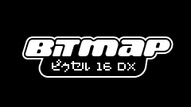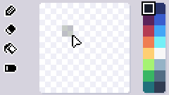
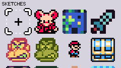

## Features
- 8×8, 16×16, and 32×32 canvas modes
- Draw, Erase, Fill, Move tools
- Undo last action
- Save/open sketches from SD card
- Built-in 16, 8, and 4-color palettes
  - Switching palettes remaps your canvas to the new colors, clamping the palette down to the new size, you can always switch back to restore the original palette.
- Export `.png` files to `bitmap16dx/exports/` (128x128 or logical size)
- Dark mode!
- Charging mode!
- Display mirroring with Puzzle Unit 8x8 RGB LED Matrix (WS2812E)

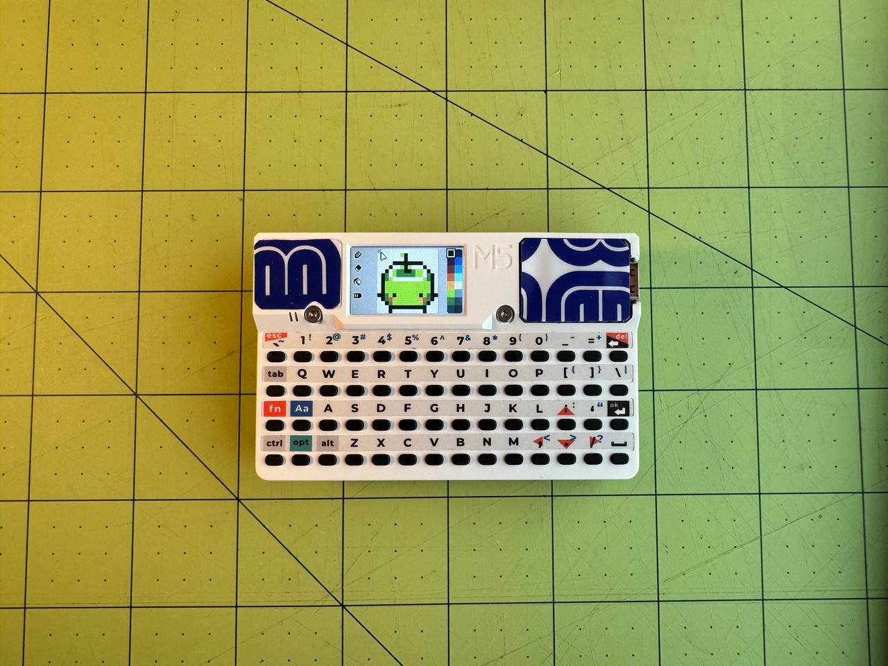

### Desktop and Cardputer Zero Simulator

The multiplatform branch includes SDL2 simulators for the 240×135 Cardputer
ADV layout and the 320×170 Cardputer Zero layout:

```sh
cmake --preset desktop
cmake --build --preset desktop
./build/desktop/bitmap16dx_desktop

cmake --preset zero
cmake --build --preset zero
./build_zero/bitmap16dx_desktop
```

The simulator persists sketches, exports, settings, and custom palettes under
`~/.local/share/bitmap16dx`. It also opens an RGB-matrix simulation window.
See [the Cardputer Zero simulator guide](platform_zero/README.md) for desktop
keyboard mappings and the complete validation checklist.

### Steam Deck quick test

The Deck preset renders a 320×200 logical framebuffer at an exact 4× scale on
the 1280×800 display and enables SDL controller input:

```sh
cmake --preset steamdeck
cmake --build --preset steamdeck
```

See [the Steam Deck sideload guide](platform_steamdeck/README.md) for the
controller layout and copy/run instructions.

### First Boot

1. **Insert SD card** before powering on (FAT32 format recommended)
2. Power on your Cardputer
3. BitMap16 DX will automatically create these folders:
   ```
   /bitmap16dx/
   ├── sketches/   # Your saved artwork
   ├── exports/    # Exported PNG files
   └── palettes/   # Custom color palettes (optional)
   ```
4. Start drawing!

### Adding Custom Palettes (Optional)
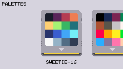
1. Download `.hex` palette files from [Lospec](https://lospec.com/palette-list)
2. Copy to `/bitmap16dx/palettes/` on your SD card
3. Power cycle your Cardputer
4. Access custom palettes in the Palette Menu

*Supports 4, 8, or 16-color palettes. Maximum 32 total (12 built-in + 20 custom).*

## How to Use

### Drawing Mode

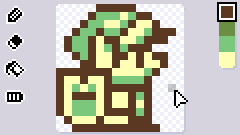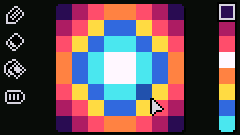

| Key | Function |
|-----|----------|
| Arrow keys (`↑` `←` `↓` `→`) | Move cursor (hold to repeat) |
| `ok`/`enter` | Place pixel with selected color |
| `del`/`backspace` | Erase pixel |
| `F` | Flood **f**ill |
| `M` + `Arrow keys` | **M**ove canvas |
| `1-8` | Quick color selection (colors 1-8) |
| `fn` + `1-8` | Quick color selection (colors 9-16) |
| `C` | **C**ycle to next color |
| `G` | Cycle the 8×8, 16×16, and 32×32 **g**rid |
| `+` / `-` | Zoom canvas in/out at integer pixel scales |
| `R` | Toggle **r**ulers (center guide lines) |
| `T` | Toggle Se**t**tings |
| `Z` | Undo last action (or just shake to undo)|
| `g0` button | Clear canvas |
| `S` | **S**ave sketch (update current or create new) |
| `FN` + `S` | **S**ave as new sketch (always creates new file) |
| `X` | E**x**port PNG (128×128 scaled) |
| `FN` + `X` | Export PNG at its logical grid size |
| `H` | Open **h**elp screen (key commands) |
| `P` | Open **P**alette Menu |
| `O` | **O**pen Sketches Menu |
| `V` | Open Pre**v**iew Mode |
| `B` + `+/-` | Adjust **b**rightness |
| `FN` + `B` | Charging Mode |
| `L` + `Ok` | RGB Matrix on/off |
| `L` + `+/-` | RGB Matrix brightness |

### Drawing Preview *(V)*

| Key | Function |
|-----|----------|
| `1` | Black background |
| `2` | White background |
| `3` | Light gray background |
| `4` | Dark gray background |
| `esc` | Dismiss |

### Palette Menu *(P)*

| Key | Function |
|-----|----------|
| `←`/`→` | Navigate palettes |
| `ok`/`enter` | Select palette |
| `esc` | Dismiss |
| `4` | Toggle 4-color filter |
| `8` | Toggle 8-color filter |
| `1` | Toggle 16-color filter|
| `U` | Toggle custom user palettes filter (can be combined with 4/8/16 filters) |
| `0` | Clear all filters |

### Sketches Menu *(O)*


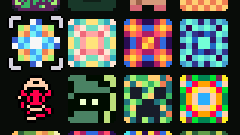

| Key | Function |
|-----|----------|
| Arrow keys (`↑` `←` `↓` `→`) | Navigate sketch grid |
| `ok`/`enter` | Load selected sketch |
| `V` | Open slideshow **v**iew |
| `esc` | Dismiss |
| `g0` button | Delete focused sketch |
| `z`  | undo |

### Sketch Slideshow View *(V from Sketches Menu)*

View your saved sketches in a fullscreen slideshow with optional auto-advance.

| Key | Function |
|-----|----------|
| `←`/`→` | Navigate previous/next sketch |
| `space` | Toggle auto-advance (3 second intervals) |
| `1` | Black background |
| `2` | White background |
| `3` | Light gray background |
| `4` | Dark gray background |
| `B` + `+/-` | Adjust **b**rightness |
| `esc` | Return to Sketches |

### Settings *(T)*

- Set UI theme (light, dark)
- Set default grid (8x8, 16x16, or 32x32)
- Set RGB matrix count (1, 4)
- Set RGB matrix rotation (0, 90, 180, 270)
- Set export format (RGB888, RGB565)
- Enable Shake to Undo (IMU accelerometer)

### Project Structure

```
BitMap16DX/
├── platformio.ini          # PlatformIO configuration
├── src/
│   ├── main.cpp           # Main firmware code
│   ├── palettes.h         # Default Color palette definitions
│   ├── icons.h            # UI icons
│   ├── cartridge_graphic.h # Cartridge sprite
│   └── boot_image.h       # Splash screen
```

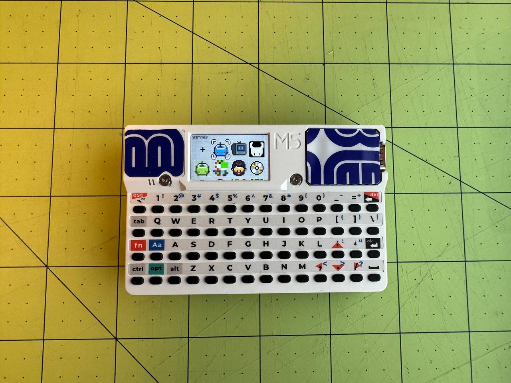
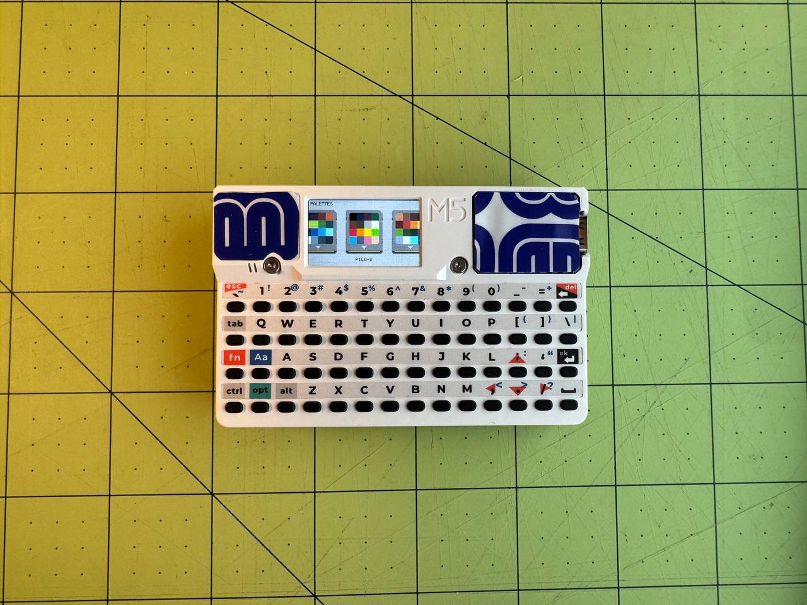

## LED Matrix Display mirroring

The RGB LED matrix display mirrors your canvas in real-time. Connect 1 or 4 Puzzle Unit 8x8 RGB LED Matrix (WS2812E) modules + chain returns to the Cardputer ADV via the expansion port. Matrix brightness and rotation are configurable in Settings.

### Quad Matrix (16x16)

<p>
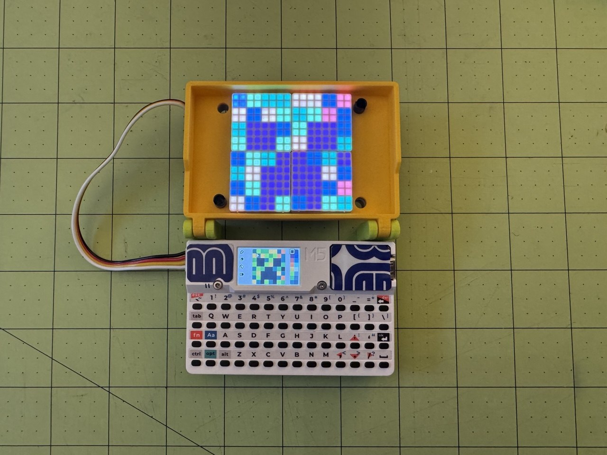
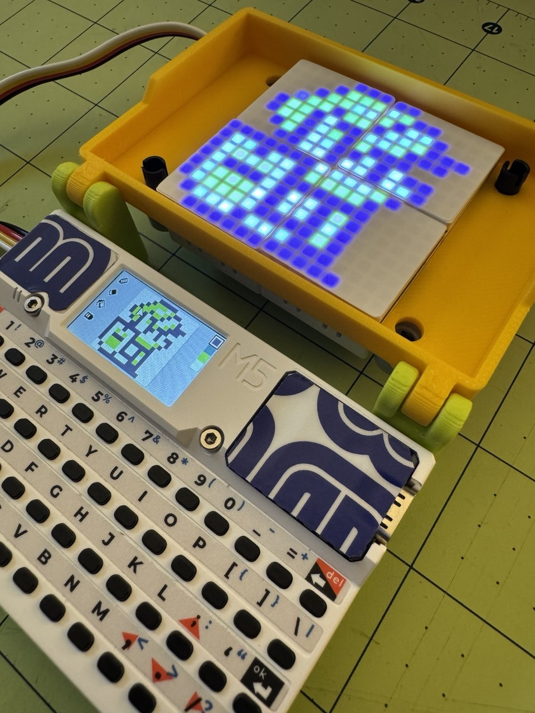
</p>

### Single Matrix (8x8)

<p>
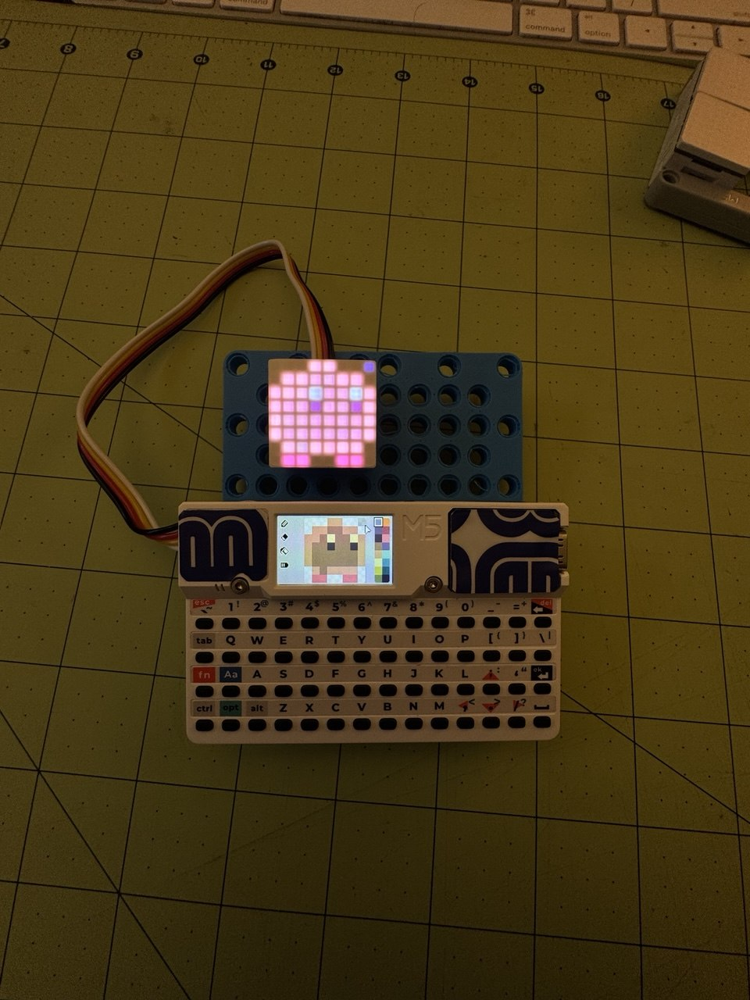
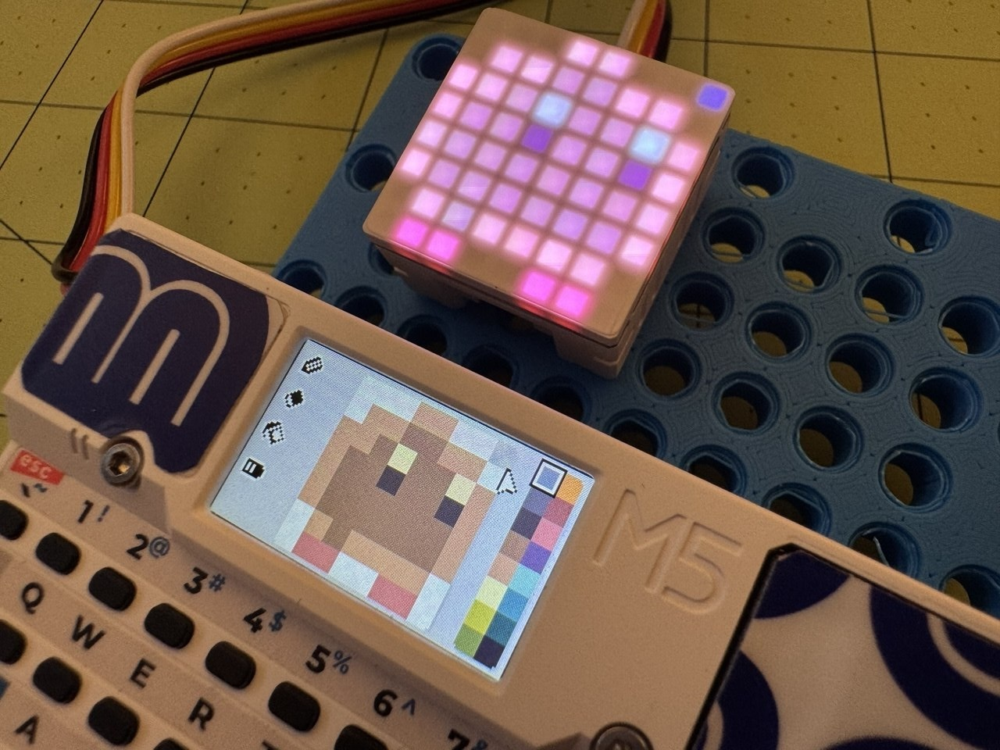
</p>

### Technic Panel Board

<p>
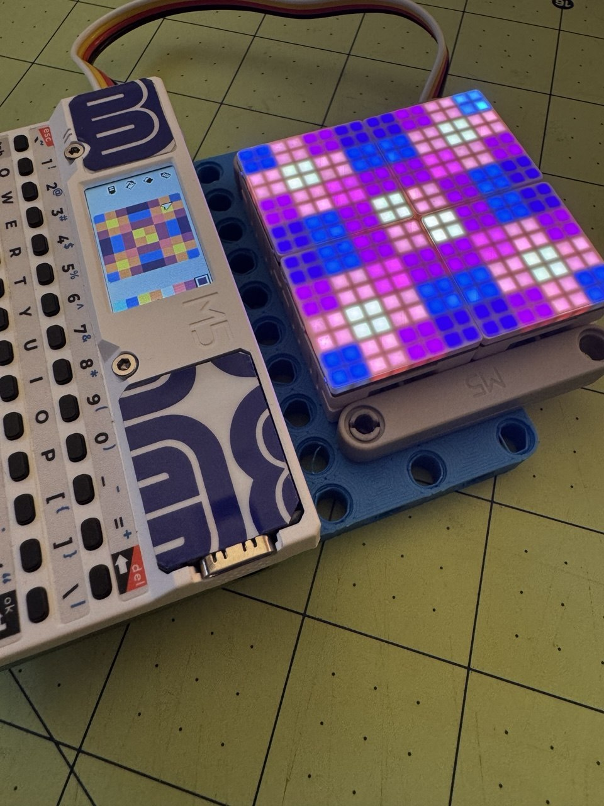
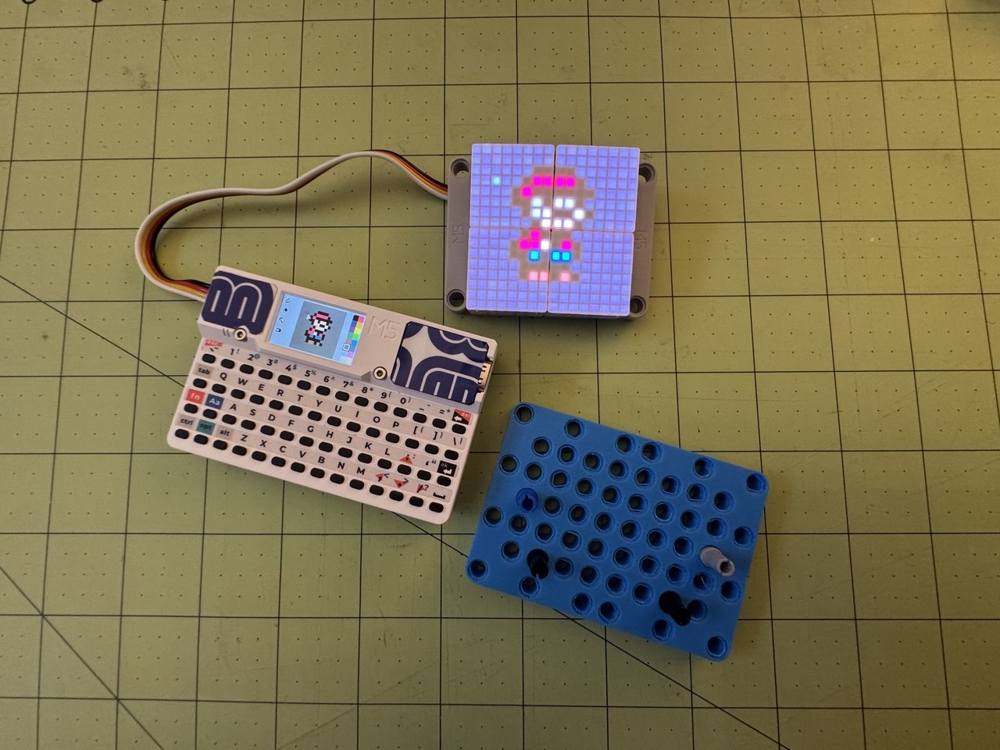
</p>

A Cardputer-sized prototype board with Lego Technic-compatible mounting holes. Designed for snapping peripherals — like the RGB matrix modules — into modular, reconfigurable layouts.
